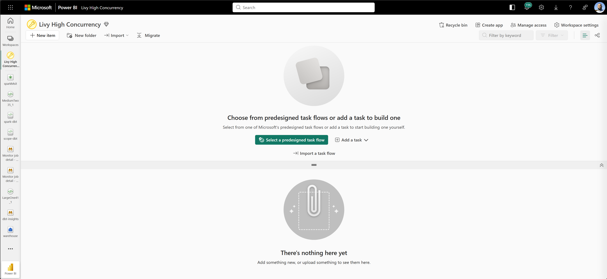
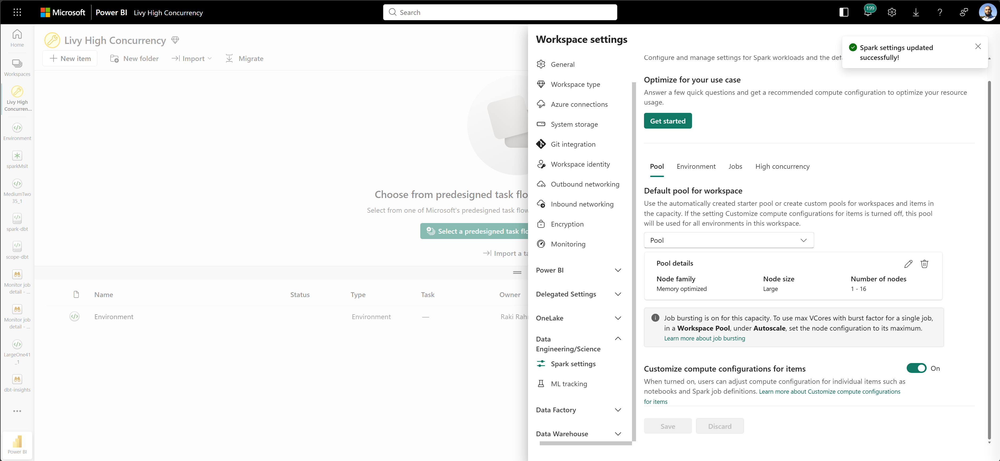
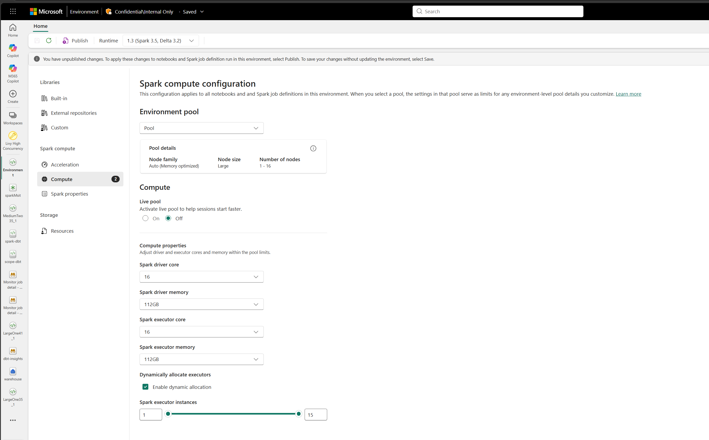
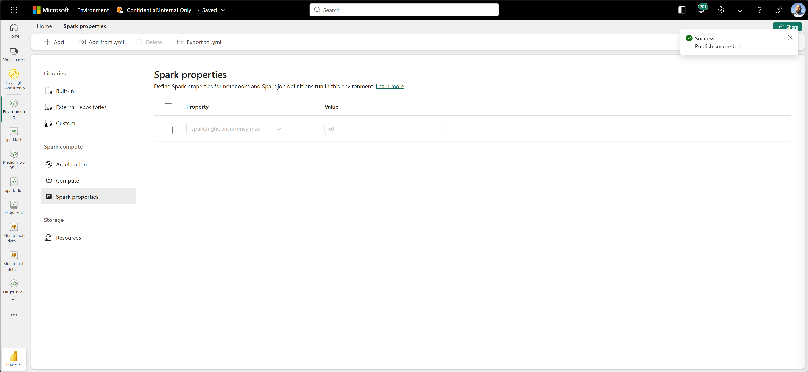
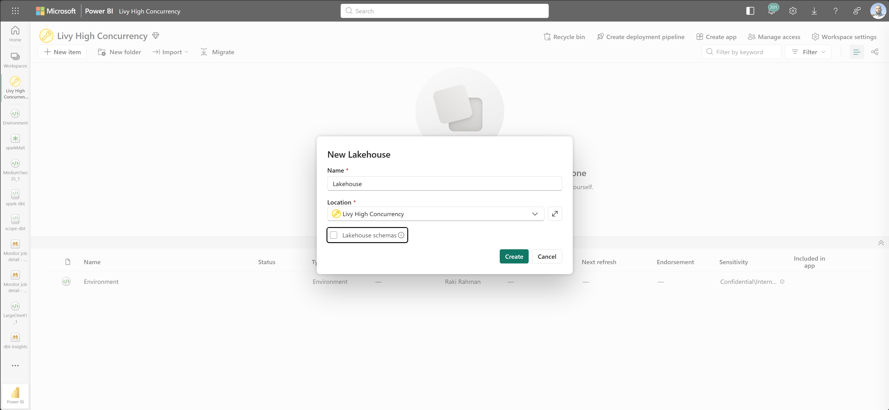
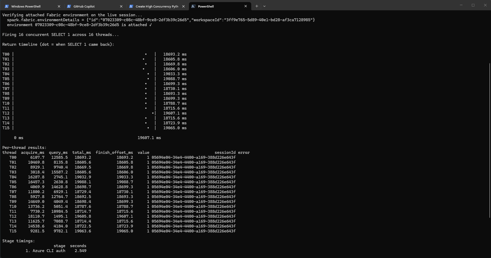

# Livy Hihh Concurrency

Creates a HC session with Livy and sees what happens

- [High concurrency support in the Fabric Livy API](https://learn.microsoft.com/en-us/fabric/data-engineering/high-concurrency-livy)
- [Regular High concurrency support in Fabric Spark](https://learn.microsoft.com/en-us/fabric/data-engineering/high-concurrency-overview#dynamic-session-sharing-limit)

## Pre-reqs

Create a Fabric Workspace:



Create a Pool - say Large so you can fire 16 on all 16 cylinders:



Create an Environment, attach the pool to it



Then add `spark.highConcurrency.max` = 50, we want to run 50 concurrenct queries in this single pool:



And finally, a Lakehouse:



## Run

```powershell
$GIT_ROOT = git rev-parse --show-toplevel

python -m venv venv
.\venv\Scripts\Activate.ps1
pip install -r requirements.txt

az login

python app.py `
  --workspace-id "3ff9e765-5d89-40e1-bd28-af3ca7128985" `
  --lakehouse-id "18a3637f-d1cd-4b9c-ac7a-7fedf0cb44ef" `
  --environment-id "07023309-c08c-48bf-9ce8-2df3b39c26d5" `
  --concurrent-queries 16
```

The app prints an ASCII timeline of when each thread's query returned, a
per-thread results table, per-stage timings, and asserts that a **single**
high-concurrency Spark session served every query:

